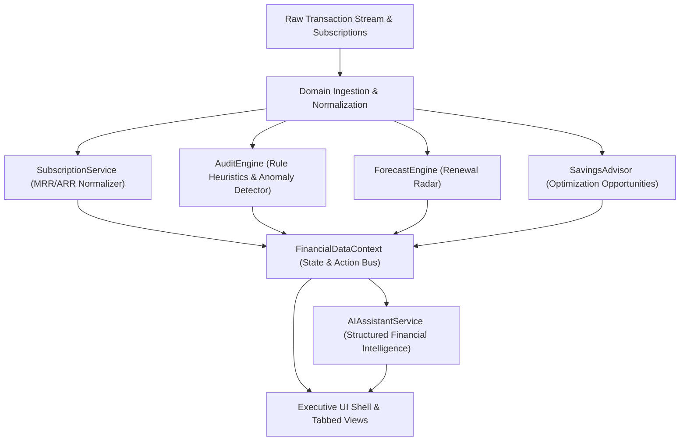

# Technical Architecture & Domain Specification

## 1. Architectural Philosophy

**AuditPulse AI** is engineered around domain-driven design (DDD) principles for financial intelligence applications. The platform separates pure domain contracts, autonomous calculation engines, reactive state management, and visual components.

---

## 2. Core Domain Contracts

### 2.1 Transaction (`src/core/types/transaction.ts`)
Represents an individual posted or pending ledger debit:
- `amount` & `currency`
- `category` (Cloud, SaaS, AI, Streaming, etc.)
- `paymentMethodId` (attributed virtual card, corporate card, or bank account)
- `confidenceScore` (0.00 to 1.00 probability that the charge represents recurring billing)
- `isRecurring` flag

### 2.2 Subscription (`src/core/types/subscription.ts`)
Represents an ongoing recurring financial commitment:
- `billingCycle`: Weekly, Monthly, Quarterly, Biannual, Annual
- `riskScore` (0 to 100) & `riskLevel` (Safe, Low, Medium, High, Critical)
- `seatsCount` & `lastActivityDate` (used for inactive zombie seat auditing)
- `autoRenew` state & direct cancellation/portal URL

### 2.3 Audit Issue (`src/core/types/audit.ts`)
Represents an algorithmic detection of waste or anomaly:
- `type`: `price_hike`, `duplicate_billing`, `zombie_subscription`, `trial_ending_soon`, `redundant_service`
- `severity`: `critical`, `high`, `medium`, `low`
- `impactMonthly` & `impactAnnual` (quantifiable cash leakage)
- `recommendedAction` & resolution status

---

## 3. Heuristic Audit Detection Rules

The `AuditEngine` implements 5 continuous audit algorithms:

1. **Price Creep / Hike Detector**:
   Compares the latest transaction amount against historical baseline debits for the same subscription ID. Flags charges exceeding a user-configurable percentage threshold (`VITE_AUDIT_PRICE_HIKE_THRESHOLD_PCT`, default: 5.0%).
2. **Multi-Card Duplicate Detector**:
   Scans active subscriptions grouped by vendor. Flags duplicate subscriptions maintained concurrently across different virtual cards or banking instruments (e.g. separate Spotify plans).
3. **Zombie Account / Inactive Seat Detector**:
   Correlates subscription license seats with user login telemetry. Flags any paid seat with 0 user sessions or edits for > `VITE_AUDIT_ZOMBIE_DAYS_THRESHOLD` (default: 60 days).
4. **Trial Expiration Radar**:
   Monitors subscriptions in `'trial'` status where `daysUntilRenewal <= 3`. Warns before automatic conversion to high-tier pricing.
5. **Redundant Service Overlap**:
   Identifies concurrent paid subscriptions with overlapping functional value (e.g. concurrent paid Dropbox and Google One storage accounts).

---

## 4. Cash Flow Forecasting

The `ForecastEngine` calculates upcoming liabilities within rolling 14-day, 30-day, and 90-day horizons:
- Converts heterogeneous billing dates into a chronological timeline
- Groups renewals by calendar date for cash flow smoothing
- Flags impending high-risk renewals to permit cancellation prior to billing execution

---

## 5. Security & Safe Execution Model

- **Synthetic Sandboxing**: Operates without external credential risks during early lifecycle phases.
- **Environment Isolation**: Configured via strictly typed `src/core/config/env.ts` with runtime defaults.
- **Cross-Browser Styling**: Glassmorphic UI elements utilize vendor prefixes (`-webkit-backdrop-filter` and `backdrop-filter`) to guarantee consistent rendering across Safari, Chrome, and Firefox.
