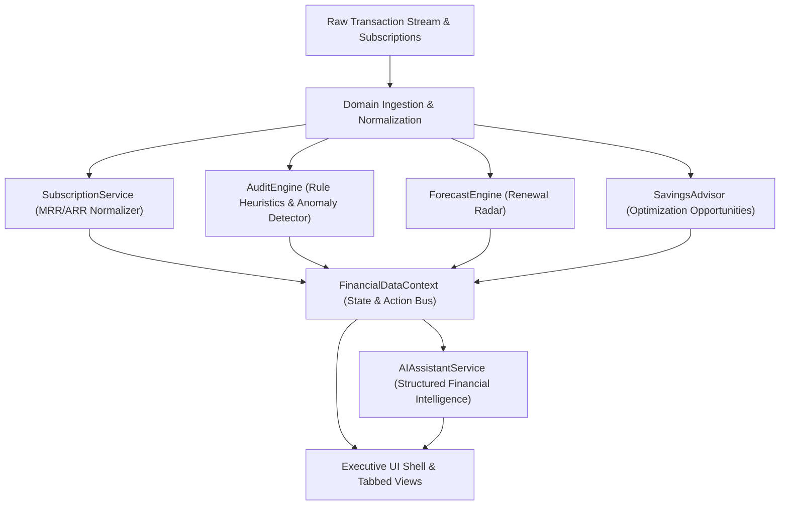

# Technical Architecture & Domain Specification

## 1. Architectural Philosophy

**AuditPulse AI** is engineered around domain-driven design (DDD) principles for financial intelligence applications. The platform separates pure domain contracts, autonomous calculation engines, reactive state management, and visual components.

---

## 2. Core Domain Contracts

### 2.1 Transaction (`src/core/types/transaction.ts`)
Represents an individual posted or pending ledger debit:
- `amount` & `currency`
- `category` (Cloud, SaaS, AI, Streaming, etc.)
- `paymentMethodId` (attributed virtual card, corporate card, or bank account)
- `confidenceScore` (0.00 to 1.00 probability that the charge represents recurring billing)
- `isRecurring` flag

### 2.2 Subscription (`src/core/types/subscription.ts`)
Represents an ongoing recurring financial commitment:
- `billingCycle`: Weekly, Monthly, Quarterly, Biannual, Annual
- `riskScore` (0 to 100) & `riskLevel` (Safe, Low, Medium, High, Critical)
- `seatsCount` & `lastActivityDate` (used for inactive zombie seat auditing)
- `autoRenew` state & direct cancellation/portal URL

### 2.3 Audit Issue (`src/core/types/audit.ts`)
Represents an algorithmic detection of waste or anomaly:
- `type`: `price_hike`, `duplicate_billing`, `zombie_subscription`, `trial_ending_soon`, `redundant_service`
- `severity`: `critical`, `high`, `medium`, `low`
- `impactMonthly` & `impactAnnual` (quantifiable cash leakage)
- `recommendedAction` & resolution status

---

## 3. Heuristic Audit Detection Rules

The `AuditEngine` implements 5 continuous audit algorithms:

1. **Price Creep / Hike Detector**:
   Compares the latest transaction amount against historical baseline debits for the same subscription ID. Flags charges exceeding a user-configurable percentage threshold (`VITE_AUDIT_PRICE_HIKE_THRESHOLD_PCT`, default: 5.0%).
2. **Multi-Card Duplicate Detector**:
   Scans active subscriptions grouped by vendor. Flags duplicate subscriptions maintained concurrently across different virtual cards or banking instruments (e.g. separate Spotify plans).
3. **Zombie Account / Inactive Seat Detector**:
   Correlates subscription license seats with user login telemetry. Flags any paid seat with 0 user sessions or edits for > `VITE_AUDIT_ZOMBIE_DAYS_THRESHOLD` (default: 60 days).
4. **Trial Expiration Radar**:
   Monitors subscriptions in `'trial'` status where `daysUntilRenewal <= 3`. Warns before automatic conversion to high-tier pricing.
5. **Redundant Service Overlap**:
   Identifies concurrent paid subscriptions with overlapping functional value (e.g. concurrent paid Dropbox and Google One storage accounts).

---

## 4. Cash Flow Forecasting

The `ForecastEngine` calculates upcoming liabilities within rolling 14-day, 30-day, and 90-day horizons:
- Converts heterogeneous billing dates into a chronological timeline
- Groups renewals by calendar date for cash flow smoothing
- Flags impending high-risk renewals to permit cancellation prior to billing execution

---

## 5. Security & Safe Execution Model

- **Synthetic Sandboxing**: Operates without external credential risks during early lifecycle phases.
- **Environment Isolation**: Configured via strictly typed `src/core/config/env.ts` with runtime defaults.
- **Cross-Browser Styling**: Glassmorphic UI elements utilize vendor prefixes (`-webkit-backdrop-filter` and `backdrop-filter`) to guarantee consistent rendering across Safari, Chrome, and Firefox.

---

## 6. Deterministic Transaction Intelligence & Recurrence Engine

### 6.1 Merchant Canonicalization & Cleansing (`MerchantNormalizer`)
Raw statement lines often contain extraneous noise:
`NETFLIX.COM LOS GATOS CA 866-579-7172` $\rightarrow$ `Netflix` (`netflix.com`)
`AWS.AMAZON.COM WA US RETAIL CLOUD COMPUTING INV-892128` $\rightarrow$ `Amazon Web Services` (`aws.amazon.com`)

The cleanser executes a two-phase pipeline:
1. **Direct Registry Matching**: Regex rules matching recognized SaaS, cloud, and media vendors.
2. **Noise Token Stripping**: Removes payment gateway prefixes (`STRIPE*`, `PAYPAL*`), phone numbers, US state abbreviations, city names, and invoice reference tokens.

### 6.2 Recurrence Statistical Analysis (`RecurringIntelligenceEngine`)
For transactions grouped by normalized merchant, the engine evaluates:
- **Interval Delta**: $\Delta D = [d_2 - d_1, d_3 - d_2, \dots]$
- **Mean Interval**: $\bar{D} = \frac{1}{N}\sum \Delta D_i$
- **Interval Standard Deviation**: $\sigma_D = \sqrt{\frac{1}{N}\sum (\Delta D_i - \bar{D})^2}$
- **Cadence Classification**:
  - Weekly: $\bar{D} \in [6, 9]$
  - Monthly: $\bar{D} \in [25, 35]$
  - Quarterly: $\bar{D} \in [80, 100]$
  - Annual: $\bar{D} \in [340, 380]$
- **Confidence Scoring & Explainability**:
  Generates deterministic confidence scores based on regularity $\sigma_D$, charge count $N$, amount variance %, and known vendor matching. Outputs transparent narratives explaining exactly why recurring status was assigned.

### 6.3 Duplicate Transaction Detection (`DuplicateDetector`)
Scans the ledger for two distinct duplicate billing patterns:
- **Same-Day Double Charge**: Identical merchant and amount on the same card within $\le 48$ hours (accidental double swipe).
- **Multi-Card Duplicate**: Active recurring charges from the same vendor on two different cards within 15 days.

---

## 7. AI Financial Copilot (Google Gemini 3.5 / 2.5 Flash)

### 7.1 Secure Backend Proxy (`server/geminiProxy.ts`)
To prevent frontend API key leakage:
- Client-side code sends requests exclusively to `POST /api/copilot`.
- The server process loads `GEMINI_API_KEY` directly from environment variables.
- Enforces request body sanitization, maximum query lengths, and 10-second request timeouts (`AbortController`).

### 7.2 Strict Anti-Hallucination Grounding (`CopilotContextBuilder`)
The copilot operates under strict deterministic constraints:
- Pre-compiles verified figures: exact Monthly Recurring Spend ($589.41), Annual Run-Rate ($7,072.92), identified leakage ($3,195.76/yr), active subscription counts, and upcoming renewals.
- The model is given explicit system instructions never to invent numbers or dates.
- All numbers cited in responses link directly to authoritative application records.

### 7.3 Zero-Downtime Fallback Architecture
If the Gemini API key is missing, network access is offline, or rate limits (HTTP 429) occur:
- The server proxy returns a `fallback: true` signal.
- The client automatically routes the query to the local `Deterministic Rules Engine`.
- Both paths yield grounded executive summaries, key findings, and immediate remediation steps.

